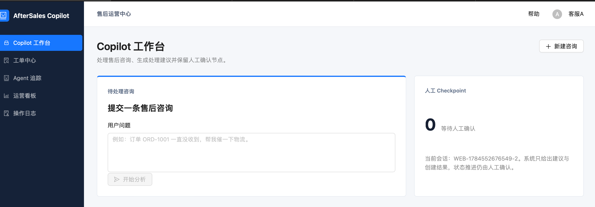
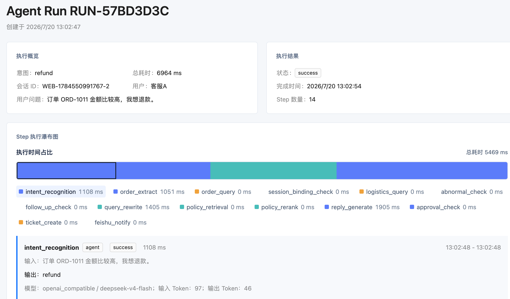
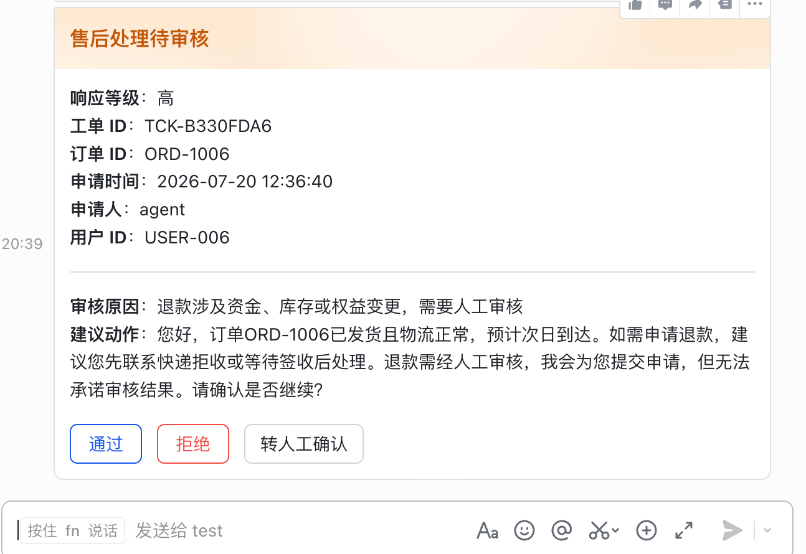
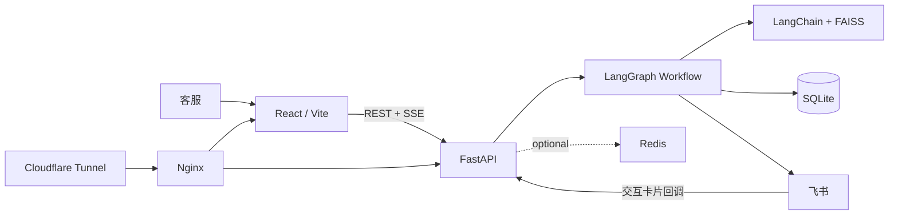

# 电商售后客服 Copilot

面向电商客服团队的售后工单 Copilot。系统将订单与物流查询、售后规则检索、客服回复草稿、工单协同、人工审核与执行链路追踪组织为一套可观察、可追溯、可人工接管的业务闭环。

> Agent 负责识别、查询、判断和建议；人工负责审核、确认和推进状态；系统负责记录全过程。

## 在线体验

**[打开在线演示](https://copilot.heyiweilai.top)**

在线环境仅使用人工构造的演示订单、物流和售后规则，所有真实用户、订单或店铺数据已做脱敏处理。

`LangGraph` `RAG` `SSE` `Redis` `Feishu Approval` `Docker Compose`

## 界面预览

### Copilot 工作台



### Agent Trace Waterfall



### 飞书人工审核



以上截图仅包含本项目的人工构造演示订单、工单和运行记录。请勿提交包含真实用户信息、Webhook URL、Token 或 App Secret 的截图。

## 业务闭环

```text
客服输入售后问题
-> Copilot 实时分析
-> 意图识别与订单号提取
-> 查询订单、物流与会话上下文
-> RAG 检索售后 SOP 和话术
-> 生成客服回复草稿
-> 创建或复用工单
-> 飞书通知或人工审核
-> 状态回写、操作审计与运营复盘
```

| 场景 | 系统处理 |
| --- | --- |
| 物流异常 / 订单未收到 | 创建或复用催物流工单，生成安抚回复并通知协同群。 |
| 物流正常查询 | 返回物流说明，不误创建工单。 |
| 未发货 / 签收争议 | 召回对应 SOP，给出客服处理建议。 |
| 退款、退货、换货、改地址、取消订单、补偿 | 创建待审核工单；Agent 提供建议，不直接执行高风险动作。 |

## 核心能力

- **实时执行链路**：前端通过 SSE 接收 `run_started`、Step 创建与最终状态；连接异常时自动降级为轮询。
- **Trace Waterfall**：每个 Agent Step 都保留状态、耗时、输入输出摘要、模型元数据与缓存命中信息，并按真实耗时比例展示。
- **RAG 规则来源**：基于 LangChain + FAISS 召回本地售后 SOP、审核规则和话术，回复结果可回看规则依据。
- **人工审核边界**：退款等资金、库存或履约风险动作进入待审核状态；审核通过、拒绝或转人工确认均会写回工单、事件与飞书记录。
- **全局操作审计**：`operation_logs` 汇总 Copilot、人工客服和飞书回调的关键动作；同时按日期写入 JSONL 文件。
- **Redis 增强与降级**：Redis 用于令牌桶限流、缓存、会话上下文和风险榜；不可用时回退到 SQLite 实时查询或直接放行，不作为业务事实来源。

## 架构



| 层级 | 组成 |
| --- | --- |
| 前端 | Vite、React、TypeScript、Ant Design、Recharts、Vitest |
| 后端 | Python、FastAPI、SQLAlchemy、Pydantic、pytest |
| Agent / RAG | LangGraph、LangChain、FAISS、可选 LLM Gateway |
| 业务数据 | SQLite：订单、物流、工单、Run、Step、飞书事件、操作日志 |
| 缓存与协同 | Redis、飞书 Webhook、自建应用机器人交互卡片 |
| 部署 | Cloudflare Tunnel -> Nginx -> Docker Compose 前后端服务 |

## 飞书协同

系统使用两条飞书通道：

- 普通物流工单通过群自定义机器人 Webhook 发送协同通知。
- 需要审核的工单通过飞书自建应用机器人发送 interactive 卡片。用户点击「通过」「拒绝」或「转人工确认」后，公网 HTTPS callback 会回写工单审核状态、事件记录和已处理卡片。

飞书配置仅通过本地 `.env` 注入，README、代码和截图不应包含 Webhook URL、App Secret、Token 等敏感信息。

## 本地启动

### 前后端开发模式

后端：

```bash
uvicorn api.main:app --host 127.0.0.1 --port 8001 --reload
```

前端：

```bash
cd frontend
npm install
npm run dev
```

打开 `http://127.0.0.1:5173/workspace`。

### Docker Compose

```bash
docker compose up --build -d
docker compose ps
```

默认入口：

- 前端：`http://127.0.0.1:5173/workspace`
- 后端健康检查：`http://127.0.0.1:8001/health`
- API 文档：`http://127.0.0.1:8001/docs`

停止服务：

```bash
docker compose down
```

容器中的 SQLite 数据库挂载到 `./data/app.db`，重启容器不会丢失本地工单与 Agent Run。

## 配置

复制 [`.env.example`](.env.example) 为 `.env` 后，按需启用 LLM、Redis 与飞书能力。默认配置不调用真实模型，也不发送真实飞书消息。

```bash
cp .env.example .env
```

支持的 LLM Provider：`disabled`、`openai_compatible`、`ollama`。真实模型只增强意图识别、订单号提取、RAG 查询改写和回复草稿；订单查询、物流判断、建单、状态流转与审核边界仍由确定性业务代码负责。

## 演示路径

建议从 [Copilot 工作台](https://copilot.heyiweilai.top/workspace) 开始，依次体验：

1. 输入 `我的订单 ORD-1001 怎么还没收到？帮我催一下物流。`，查看实时 Step、RAG 来源与催物流工单。
2. 输入 `订单 ORD-1002 的物流到哪里了？`，验证正常物流场景不会误建单。
3. 输入 `订单 ORD-1006 金额比较高，我想退款。`，查看待审核工单和飞书审核卡片。
4. 在工单中心查看审核状态、事件时间线和关联 Run；在 Agent 追踪页查看 Trace Waterfall；在运营看板查看统计和风险榜。

完整可复制用例见 [docs/LOCAL_DEMO.md](docs/LOCAL_DEMO.md)，演示讲解顺序见 [docs/DEMO_SCRIPT.md](docs/DEMO_SCRIPT.md)。

## 验证

```bash
/opt/anaconda3/envs/rag_910/bin/python -m pytest -q
cd frontend && npm run test:run
cd frontend && npm run build
docker compose config --quiet
```

## 文档

- [项目展示材料](docs/PROJECT_SHOWCASE.md)
- [当前实施状态](docs/STATUS.md)
- [产品与技术规划](ecommerce_after_sales_copilot_plan.md)
- [本地演示用例](docs/LOCAL_DEMO.md)
- [协作规则](AGENTS.md)

## 当前边界与演进

- 当前订单、物流和售后规则均为本地 fake data，尚未接入真实电商平台。
- RAG 当前以人工整理的短规则 Document 为检索单元，使用 deterministic embedding；真实 embedding、长文档切分、向量数据库与 reranker 是后续演进方向。
- SQLite 适合本地演示和单机部署；生产化可迁移至 PostgreSQL，并补齐认证、多租户与权限体系。
- RabbitMQ 可靠投递仍后置，用于飞书通知失败重试、长耗时模型任务重试与失败告警。
